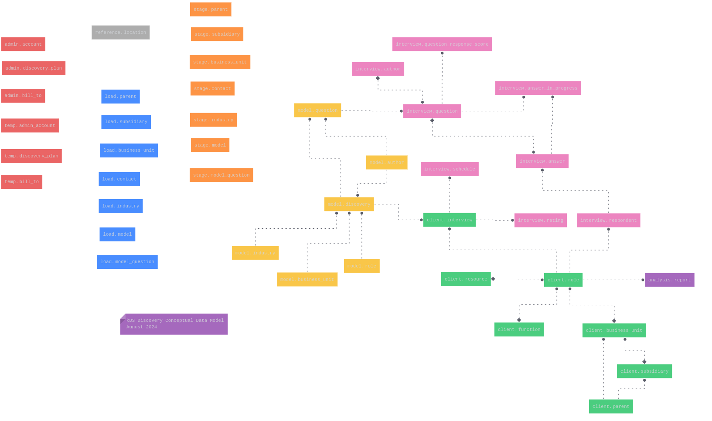

# Chatbot Data Discovery Interview App

## Introduction

In today's data-centric world, organizations are searching for ways to unlock the full potential of their data. Data discovery, which involves finding, collecting, and analyzing data from various sources to uncover valuable insights, is crucial for this purpose.

However, traditional methods are often cumbersome and inefficient, relying on manual surveys, disparate data collection, and time-consuming interviews. Many organizations still depend on spreadsheets for data discovery, leading to fragmented and error-prone management.

To address these challenges, this project introduces a **Chatbot Data Discovery Interview App**, leveraging conversational AI to automate interviews, gather structured data, and reduce the time needed for data collection. The following sections will explore the workflow, database design, and key components of the application, using a wholesale distribution business as an example to illustrate the workflow and database schema.

## Workflow Description

### 1. Generating Model Interview Questions
The first step is generating model interview questions tailored to specific roles in various industries and business units. For example, a sales manager in a wholesale distribution business might be asked questions such as:

- What are the primary sources of data you use for your daily tasks (e.g., CRM systems, sales reports, customer feedback)?
- What specific tools or software do you use to acquire sales data (e.g., Salesforce, Excel, Power BI)?
- How do you collect customer interaction and sales performance data?
- Do you use any third-party data sources? If so, which ones?
- Are there any internal systems you rely on for data collection and analysis?
- How frequently do you access sales data (e.g., daily, weekly, monthly)?

### 2. Gathering Client Data
Once model questions are generated, the next step is to gather client data based on industry, business unit, and role. This allows the app to match client data with model data for accurate analysis results.

### 3. Conducting the Interview
The chatbot conducts interviews with client contacts, asking the generated data discovery questions. The responses are stored in a PostgreSQL database.

### 4. Data Analysis and Follow-Up
After data collection, the gathered information is analyzed for insights. Follow-up interviews may be scheduled based on the analysis to gather more detailed information or clarify responses.

## Database Design

The database design supports the chatbot-based application with various schemas and tables to store and manage data effectively. Below is an overview of the key schemas and tables.

### Schemas
- **admin**: Stores administrative data.
- **analysis**: Stores analysis results.
- **client**: Manages client-related data.
- **interview**: Handles the interview process data.
- **model**: Stores model questions and related metadata.
- **reference**: Manages reference data.
- **load**: Stores data related to subsidiaries, parent organizations, industry, contacts, and business units.
- **stage**: Stores staging data before loading into the main schema, including data about subsidiaries, parent organizations, industries, contacts, and business units.

### Tables and Their Purposes

#### Model Tables
- **model.role**: Stores roles within the model (e.g., "Sales Manager").
- **model.business_unit**: Stores information about different business units.
- **model.industry**: Stores industry information using NASIC codes.
- **model.author**: Contains data about authors who create the interview questions.
- **model.interview**: Links roles, business units, industries, and authors to specific interview models.
- **model.question**: Stores interview questions and their metadata.

#### Client Tables
- **client.role**: Stores client-specific roles and associated data.
- **client.interview**: Contains client responses and links to model interview questions.

#### interview Tables
- **interview.schedule**: Tracks interview schedules.
- **interview.rating**: Stores ratings and conditions related to responses.
- **interview.question**: Contains detailed information about each question, including type, tags, and metadata.
- **interview.question_response_score**: Links questions to possible response scores.
- **interview.answer**: Stores the actual answers provided by respondents.
- **interview.answer_in_progress**: Tracks partial responses and answers in progress.

#### Load Tables
- **load.subsidiary**: Stores information about subsidiaries.
- **load.parent**: Stores information about parent organizations.
- **load.model_question**: Stores model questions.
- **load.model**: Stores model data related to business units, NASIC codes, and roles.
- **load.industry**: Stores industry descriptions.
- **load.contact**: Stores contact information related to organizations.
- **load.business_unit**: Stores information about business units.

#### Stage Tables
- **stage.subsidiary**: Stores subsidiary information.
- **stage.parent**: Stores parent organization data.
- **stage.model_question**: Stores model questions in JSONB format.
- **stage.model**: Stores model data including NASIC codes and business units.
- **stage.industry**: Stores industry information and NASIC codes.
- **stage.contact**: Stores contact details related to organizations.
- **stage.business_unit**: Stores business unit information and relationships to parent and subsidiary data.

## Database Installation 

To date ALL database development work has been done on PostgreSQL 14.13 on Linux Mint 21.3 Cinnamon. For help with installing PostgreSQL,[see](https://postgresql.org). Once installed,run "bash 0030_install_database.sh" from the command line in a local github cloned directory.
### Update 2024-10-02
 "bash 0030_install_database.sh"  installs a database and loads the "load" schema.  To load the "stage" and "model" schemas,  run "bash 0034_stage_model_data.sh".

